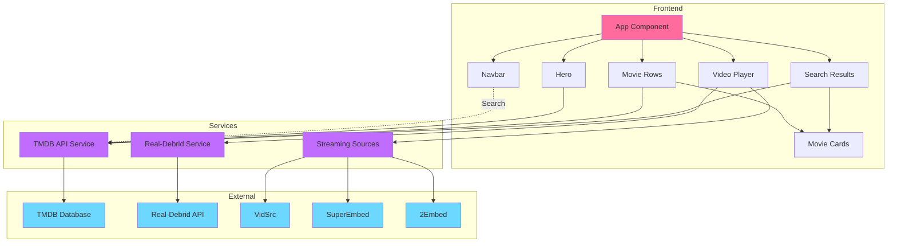

# 💖 Snuggleflix

> A cozy Netflix clone perfect for movie nights with your BF, friends, or solo binge-watching sessions!


## ✨ Features

- 🎬 **Beautiful Movie Cards** - Cute, cozy design perfect for night browsing
- 🔍 **Smart Search** - Find movies and TV shows instantly
- 🎥 **Multiple Streaming Sources** - VidSrc, SuperEmbed, 2Embed, and more
- 📋 **Copy Stream URLs** - Easy sharing with Real-Debrid or other players
- 🌟 **Real-Debrid Integration** - Premium streaming support
- 📱 **Fully Responsive** - Works great on all devices
- 🎨 **Cozy Aesthetic** - Soft gradients and warm colors for comfy viewing

## 🚀 Quick Start

### 1. Install Dependencies

```bash
npm install
```

### 2. Get Your TMDB API Key

1. Visit [TMDB](https://www.themoviedb.org/settings/api)
2. Create a free account and get your API key
3. Open `src/services/api.js`
4. Replace `YOUR_TMDB_API_KEY` with your actual API key

```javascript
const TMDB_API_KEY = 'your_actual_api_key_here'
```

### 3. Run the App

```bash
npm run dev
```

Visit `http://localhost:3000` and enjoy! 🎉

## 🎯 How to Use

### Basic Usage

1. **Browse Movies** - Scroll through trending movies, TV shows, and popular content
2. **Search** - Use the search bar to find specific titles
3. **Watch** - Click on any movie card to open the video player
4. **Switch Sources** - Try different streaming sources if one doesn't work

### Using Real-Debrid (Optional)

1. Get your Real-Debrid API token from [real-debrid.com/apitoken](https://real-debrid.com/apitoken)
2. Click on a movie to open the player
3. Click "Setup Real-Debrid"
4. Enter your API token and save
5. Now you can use premium links!

### Copy Stream URL Feature

Perfect for using with external players or Real-Debrid:

1. Open any movie
2. Click "Copy Stream URL"
3. Paste it into your preferred video player or Real-Debrid
4. Enjoy ad-free, premium streaming!

## 🎨 Customization

### Change Colors

Edit the CSS files to customize the color scheme:

- Primary color: `#ff6b9d` (pink)
- Secondary color: `#c06cff` (purple)
- Accent color: `#6cd8ff` (blue)

### Add More Streaming Sources

Edit `src/services/api.js` and add to the `getAlternativeStreamUrls` function:

```javascript
{
  name: 'Your Source',
  url: `https://your-source.com/embed/${type}/${id}`
}
```

## 📁 Project Structure

```
Snuggleflix/
├── public/
│   └── snuggle-icon.svg
├── src/
│   ├── components/
│   │   ├── Navbar.jsx
│   │   ├── Hero.jsx
│   │   ├── MovieRow.jsx
│   │   ├── MovieCard.jsx
│   │   ├── VideoPlayer.jsx
│   │   └── SearchResults.jsx
│   ├── services/
│   │   ├── api.js
│   │   └── realDebrid.js
│   ├── App.jsx
│   ├── App.css
│   ├── main.jsx
│   └── index.css
├── index.html
├── vite.config.js
└── package.json
```

## 🛠️ Tech Stack

- **React** - UI framework
- **Vite** - Build tool
- **Axios** - HTTP client
- **Lucide React** - Beautiful icons
- **TMDB API** - Movie database
- **VidSrc** - Free streaming API

## 🏗️ Architecture



## 🔧 Troubleshooting

### No movies showing?

- Check that you've added your TMDB API key in `src/services/api.js`
- Make sure your API key is valid

### Videos not loading?

- Try switching between different streaming sources
- Some sources may be blocked in your region
- Use a VPN if needed

### Real-Debrid not working?

- Verify your API token is correct
- Check your Real-Debrid subscription is active
- Make sure the token has proper permissions

## 🌟 Streaming Sources

Snuggleflix includes multiple free streaming sources:

- **VidSrc** - Primary source with good quality
- **VidSrc Pro** - Alternative VidSrc server
- **SuperEmbed** - Multi-source aggregator
- **2Embed** - Reliable backup source

## 📝 Notes

- This is for educational purposes
- Always respect copyright laws in your country
- Consider supporting official streaming platforms
- Free sources may have ads or quality limitations

## 🤝 Contributing

Feel free to:

- Add more streaming sources
- Improve the UI/UX
- Fix bugs
- Add new features

## 📄 License

MIT License - Feel free to use this project however you like!

## 💕 Made with Love

Perfect for:
- Movie nights with your significant other
- Friend group watch parties
- Solo cozy viewing sessions
- Discovering new content

Enjoy your cozy movie nights! 🍿✨

---

**Note:** Remember to add your TMDB API key before running the app!
